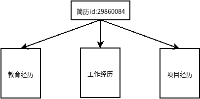

# ES-KG-Recommended（大数据下简历的搜索和排序）

## 仓库建立初衷

主要是因为参加第二届“慧源共享”全国高校开放数据创新研究大赛，然后这里就是我们团队存放代码和相关文件的地方了。

至于为什么选择e成科技简历脱敏调查数据集来做目前这个大数据下简历的搜索和排序，主要是因为团队成员同样将面临找工作的问题，希望能够对我们有所启发；另一个就是其他数据集很多是来自图书馆的数据，这个个人感觉只能得到统计学上的结果。虽然可能是因为主办单位有许多高校图书馆。
Elasticsearch
大家在浏览仓库代码或文件的时候可能会产生一些文件不存在等的疑问，这主要是因为比赛数据不能公开，望大家见谅。

## 代码环境
### 硬件环境
主要是我们团队成员的个人笔记本（PC），配置就不在这里列了，相信大家目前PC的基本配置都是可以支撑程序运行的。
### 软件环境

1. 操作系统：ubuntu18.04，所以我们不保证在其他操作环境下能够正常运行；
2. 相关软件：
    1. Elasticsearch:主要承担简历数据的存储和搜索；## 综合排序评价指标建立
    2. Kibana：可以辅助对Elasticsearch进行操作；
    3. Pycharm：主要编写python脚本程序，实现对Elasticsearch的自动化操作；
    4. Anaconda:主要是为python提供第三方库；
    5. jupyter notebook：可以交互式编程，主要负责测试工作。

### 软件环境的安装配置

这里暂时就不赘述了，主要用的都是主流系统、软件和开源软件。后期有空在详细写下安装配置过程。

1. ubuntu18.04：这个系统镜像如果从官网下载的话，速度真心还不慢。可以点击[here](http://jxz2dz.natappfree.cc/static/files/ubuntu-18.04.4-desktop-amd64.iso)帮我测试下是否能从我自己搭建的网站下载。至于系统安装就不详细介绍了，百度一下啥都有，主要区别在于不同品牌的电脑进入BISO的操作略微有些不同。
2. Elasticsearch：这是开源软件，有自己的官网。人家的教程比我的详细，只要安装成功就可以了。点击在[here](http://jxz2dz.natappfree.cc/static/files/)下载。
3. kibana：同Elasticsearch。点击在[here](http://jxz2dz.natappfree.cc/static/files/kibana-7.8.0-amd64.deb)下载。
4. Pycharm：ubuntu的应用商店就有，点击安装就可以了。点击在[here](http://jxz2dz.natappfree.cc/static/files/pycharm-community-2020.1.2.tar.gz)下载。
5. Anaconda：这个网上教程很多，点击在[here](http://jxz2dz.natappfree.cc/static/files/Anaconda3-2020.02-Linux-x86_64.sh)下载。
6. jupyter notebook: 这个安装了Anaconda也就有了。

## First：认识数据

这里主要是熟悉，了解，探索一下简历数据是怎样，各字段都代表什么含义，如何着手进行研究等等。参考[exploreData.ipynb](./dataset/exploreData.ipynb)

### 一个简历样本数据

具体的简历数据样本和样本数据中各字段含义可到[exploreData.ipynb](./dataset/exploreData.ipynb)查看。可以看出一份简历主要有4部分构成：

1. id： 表示了简历的所属人；
2. 教育经历：主要包括受教育时间，受教育高校，学习专业；
3. 工作经历：工作过的公司，时间，规模，职位等；
4. 项目经历：参与的项目，负责内容，时间等。

### 外引数据——schoolRange.xlsx

在该数据表中主要存储了中国高校排名，参考[2019-2020中国大学排名800强完整榜单（校友会最新版）](https://www.dxsbb.com/news/5463.html)，内部的缺失数据已经人工补齐。主要用于在为搜索到的简历排序时，为教育经历提供参考依据。

## Second:搜索方法构建

### 入口条件（输入）

在该搜索栏中输入自己对简历的要求。

### 关键词提取

从语句中提取关键字，并将其投入到相应类目的箱子里（教育，工作，项目）。

**[jieba分词](URL)：**

1. 安装：

    pip install jieba

2. 以搜索引擎模式分词：

    seg_list = jieba.cut_for_search("小明硕士毕业于中国科学院计算所，后在日本京都大学深造") #搜索引擎模式

     # 输出：'小明,硕士,毕业,于,中国,科学,学院,科学院,中国科学院,计算,计算所,，,后,在,日本,京都,大学,日本京都大学,深造'

### 关键词分类——工作，项目，教育

### 搜索

搜索所有符合条件的简历。

## Third：排序方法构建

基本思想：将多方面条件综合形成综合得分，类似多目标优化变为单目标优化。

### 综合排序评价指标建立

$$ Score = a*W + b*E + c*P $$

其中a,b,c分别是工作经历，教育经历和项目经历在综合排序评价指标中所占比重，这个由企业用户根据自己的招聘标准进行选择，但要满足以下条件：

1. $ 0 \leq a \leq 1; $
2. $  0 \leq b \leq 1; $
3. $  0 \leq c \leq 1; $
4. $a + b + c = 1.$

得分使用百分制，所以

1. $0 \leq W \leq 100;$
2. $0 \leq E \leq 100;$
3. $0 \leq P \leq 100;$
4. $0 \leq Score \leq 100.$

### 教育经历得分E的设定

$$ E = （d^2*（s/10）*m）/10 $$

其中，$d$表示求职者的最高学历（如本科，硕士，博士），$s$表示最高学历的毕业高校，$m$表示所学专业。

公式中：

1. 学历的递增代表的能力并不是线性的，故这里采用指数（平方）函数；
2. 其毕业高校和所学专业代表了学历的含金量，其数值分别参考高校排名中的综合得分和推荐星级；
3. $d \in \{1,2,3\}, d^2 \in \{1,4,9\}$；$s \in [0,100]$;$m \in [0,10]$。所以构造的上述公式其值$E \in [0,100]$。

### 工作经历得分W的设定

$$W = log(y+1)*\hat{y}*（log(max(c))_2）$$

公式中：

1. $y$表示工作的年限，其作为工作经验的衡量指标。之所以采用对数函数，是因为经验往往在最初增长速度最快，以后慢慢变缓。$y+1$使其避免为负数；
2. $\hat{y}$表示求职者在每一家公司或企业任职的平均时间，时间越短，稳定性越差，其余$W$是成正相关的关系。
3. 企业规模：求职者在不同公司工作过也侧面反映了其工作能力，这里选用规模最大的公司（以公司员工数量作为衡量标准），之所以取对数是因为数量差距太大，转换成规模等级，并用指数来体现他们的非线性关系。

### 项目经历得分P的设定 

$$ P = log(n+1)*\hat{n}$$
下通过命令行输入：
公式中：

1. $n$表示参与项目的树木，其同工作经历中的工作年限的设定是一样的，采用对数函数。$n+1$使其避免为负数；
2. $\hat{n}$表示求职者在所有项目中的平均参与力度，通过计算describe和responsibilities的文本相似度来得到。
3. 由于项目企业即甲方的信息太少，公式中不列出，主要可用于作为简历筛选参数的设定。

## 创建web应用

**1. 新建项目：**

在命令行中输入

    django-admin startproject webapp

**2. 创建应用：**

在**manage.py**在同一目录下通过命令行输入：

python manage.py startapp SR

3. 

